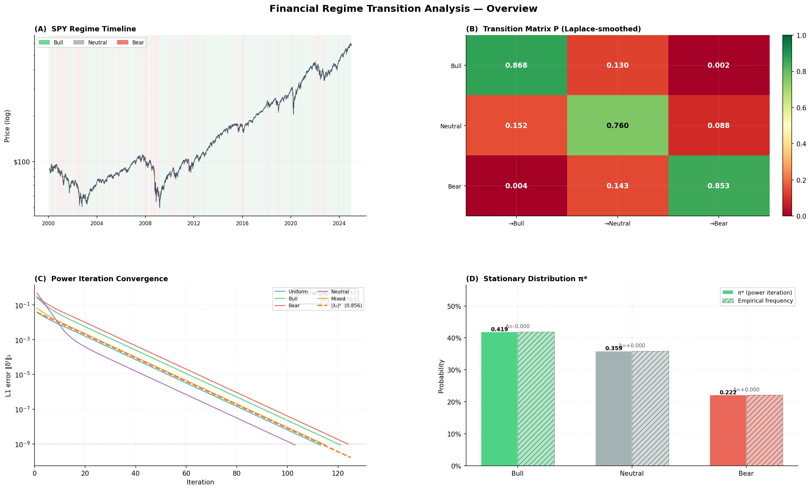
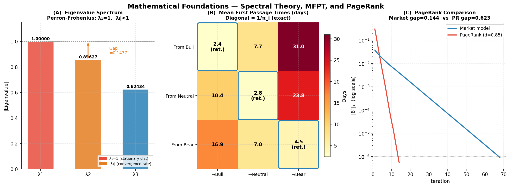
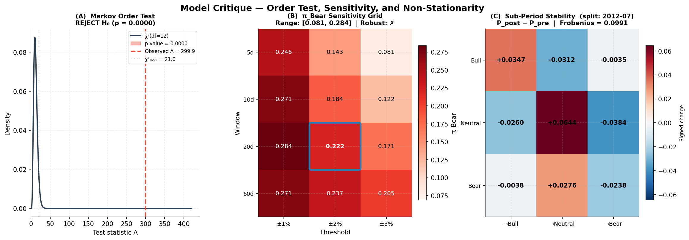

# Financial Regime Transition Analysis

> **PageRank is a Markov chain. So is a market.**

This project demonstrates that the PageRank algorithm and financial regime modelling share identical mathematical foundations, both compute the **stationary distribution of a Markov chain via power iteration**, then apply that machinery to model S&P 500 market regime dynamics.

---

## Project Architecture

```
financial-regime-markov/
├── data/
├── notebooks/
│  └── exploration.ipynb
├── src/
│   ├── data_pipeline.py      # SPY data → Bull/Neutral/Bear regimes
│   ├── transition_matrix.py  # MLE estimation, Laplace smoothing, bootstrap CIs
│   ├── markov_engine.py      # power iteration, spectral analysis, PageRank comparison
│   ├── analysis.py           # MFPT, Markov order test, sensitivity analysis
│   └── visualize.py          # Publication-quality figures for each milestone
├── tests/                    # 150 unit tests across 4 modules
├── visualizations/           # All generated figures
├── main.py                   # ← Run everything with one command
└── requirements.txt
```

---

## Quick Start

```bash
pip install -r requirements.txt

# Real SPY data:
python main.py
```

---

## Mathematical Foundation

### PageRank = Stationary Distribution of a Markov Chain

PageRank and this project solve the **identical equation**:

$$\pi^{(t+1)} = \pi^{(t)} P$$

| Concept | PageRank | Market Regime Model |
|---------|----------|---------------------|
| States | Web pages | Bull / Neutral / Bear |
| Transitions | Hyperlink clicks | Empirical regime transitions |
| Transition matrix P | Web graph (column-stochastic) | Estimated from SPY data |
| Damping / regularisation | d = 0.85 (ergodicity guarantee) | Laplace-α smoothing |
| Stationary distribution | PageRank vector | Long-run regime probabilities |
| Algorithm | Power iteration | **Same algorithm** |

**Why the PageRank engine works on market data:** The Perron-Frobenius theorem guarantees that any positive, irreducible, row-stochastic matrix has a unique stationary distribution, and power iteration converges to it geometrically at rate $|\lambda_2|$. Laplace smoothing plays the role of the damping factor, both ensure strict positivity, which guarantees ergodicity.

---

## Data and Regime Definition

**Source:** SPY ETF adjusted close, Yahoo Finance, 2000–2024

**Regime classification:**

$$\text{regime}_t = \begin{cases} 
\text{Bull} & r_t^{20} > +2\% \\ 
\text{Bear} & r_t^{20} < -2\% \\ 
\text{Neutral} & \text{otherwise} 
\end{cases}$$

where $r_t^{20} = (P_t - P_{t-20}) / P_{t-20}$ is the trailing 20-day return.

**Note on overlapping observations:** consecutive rolling-window observations share 19 days of data, inflating apparent transition persistence. We address this by reporting a non-overlapping subsample and testing robustness explicitly.

---

## Results

### Transition Matrix

Estimated via maximum likelihood: $\hat{P}_{ij} = n_{ij} / n_i$, then Laplace-smoothed with $\alpha = 1$ (uniform Dirichlet prior).

|  | → Bull | → Neutral | → Bear |
|---|---|---|---|
| **Bull** | 0.8677  [0.854, 0.880] | 0.1304  [0.118, 0.144] | 0.0019  [0.001, 0.004] |
| **Neutral** | 0.1522  [0.139, 0.168] | 0.7595  [0.741, 0.776] | 0.0883  [0.077, 0.100] |
| **Bear** | 0.0036  [0.001, 0.008] | 0.1431  [0.126, 0.163] | 0.8533  [0.833, 0.870] |

*Values: point estimate  95% bootstrap CI (B=2,000)*

### Stationary Distribution

| Regime | $\pi^*$ (model) | Empirical freq. | $E[\text{duration}]$ |
|--------|----------------|----------------|----------------------|
| Bull    | 0.4192 | 0.4193 | 7.6 days |
| Neutral | 0.3591 | 0.3591 | 4.2 days |
| Bear    | 0.2216 | 0.2216 | 6.8 days |

$\pi^*$ and empirical frequencies agree closely — an internal consistency check on the estimation.

Expected duration formula: $E[d_i] = 1/(1 - P_{ii})$ — exact consequence of the geometric sojourn time distribution implied by the Markov property.

### Spectral Analysis

| Metric | Value | Interpretation |
|--------|-------|----------------|
| $\lambda_1$ | 1.00000000 | Must equal 1.0 (Perron-Frobenius ✓) |
| $\lambda_2$ | 0.856271 | Convergence rate per iteration |
| Spectral gap $1-\lambda_2$ | 0.143729 | Larger = faster mixing |
| Iterations to converge | 113 | At tolerance $10^{-9}$ |
| $\|\pi_{\text{power}} - \pi_{\text{eigen}}\|_\infty$ | 2.56e-09 | Both methods agree |

**PageRank comparison:** The PageRank damping factor $d=0.85$ forces $|\lambda_2| \leq 0.85$ by construction — a structural guarantee that the market model does not have. The market model's $|\lambda_2| = 0.8563$ reflects actual regime persistence in the data.

### Mean First Passage Times

$M_{ij}$ = expected trading days to reach regime $j$ from regime $i$ for the first time.

| From \ To | Bull | Neutral | Bear |
|---|---|---|---|
| **Bull** | 2.4 | 7.7 | 31.0 |
| **Neutral** | 10.4 | 2.8 | 23.8 |
| **Bear** | 16.9 | 7.0 | 4.5 |

Diagonal = mean return time $= 1/\pi_i$ (exact theoretical result from ergodic Markov theory).

**Computation:** Each column solves the $(n-1) \times (n-1)$ linear system $(I - P_{-j,-j}) \mathbf{m} = \mathbf{1}$.

**Bear recovery path:** Given a Bear exit, $P(\text{next} = \text{Neutral}) = 0.975$ — Bear markets almost always transition through Neutral before reaching Bull. The MFPT Bear → Bull (16.9 days) includes this intermediate stop.

---

## Model Limitations

### 1. Markov Order Test

**H₀:** First-order Markov is sufficient.

$$\Lambda = 2(\ell_2 - \ell_1) = 299.88 \sim \chi^2(12) \text{ under H₀}$$

**Result:** p = 0.000000 → **REJECT H₀**

REJECT H0 (p = 0.0000 < 0.05): The data provide significant evidence that the second-order Markov model fits better. Markets carry memory beyond a single lag — the first-order Markov assumption is a simplification.

The first-order model is used because it is the minimal structure to demonstrate the core mathematics. The natural extension — Hidden Markov Models — treats the regime as latent and can implicitly encode richer temporal dependence.

### 2. Sensitivity to Parameter Choices

| Parameter | Range tested | $\pi_{\text{Bear}}$ range |
|-----------|-------------|--------------------------|
| Window | 5, 10, 20, 60 days | [0.081, 0.284] |
| Threshold | ±1%, ±2%, ±3% | (combined above) |

**Qualitative robustness:** The absolute level of π_Bear is sensitive to parameter choice. The qualitative structure (Bull and Bear are persistent; Neutral is transient) holds across all combinations.

### 3. Non-Stationarity

Sub-period analysis (split: 2012-07) shows transition dynamics are not constant:
- Frobenius norm of $(P_{\text{post}} - P_{\text{pre}})$: **0.0991**
- Maximum element change: **0.0644**

The model estimates average dynamics over the full period. Time-varying transition matrices (rolling re-estimation) would address this.

---

## Figures

### Overview Dashboard


### Mathematical Foundations


### Model Critique


---

## Testing

```bash
# Run all 150 tests:
python -m pytest tests/ -v

# Individual milestones:
python -m pytest tests/test_data_pipeline.py    # 22 tests
python -m pytest tests/test_transition_matrix.py # 25 tests
python -m pytest tests/test_markov_engine.py     # 53 tests
python -m pytest tests/test_analysis.py          # 50 tests
```

Key test categories:
- **Exact formulas:** MFPT diagonal $= 1/\pi_i$, MFPT linear system, geometric duration formula
- **Statistical properties:** bootstrap CIs widen with shorter series; Laplace → uniform as $\alpha \to \infty$
- **Edge cases:** absorbing states, i.i.d. sequences, zero-count rows, non-square matrices

---

## Extensions

1. **Hidden Markov Model** — treat regime as latent; infer via Baum-Welch (EM). Addresses the Markov order test rejection and overlapping-observation bias simultaneously.
2. **Time-varying $P$** — rolling-window re-estimation with exponential weighting of recent observations.
3. **Regime-conditioned factor analysis** — given the current regime posterior, compute expected return and volatility; directly applicable to risk overlay strategies.
4. **Continuous-state extension** — Ornstein-Uhlenbeck process for log-volatility; the stationary distribution becomes Gaussian rather than discrete.
